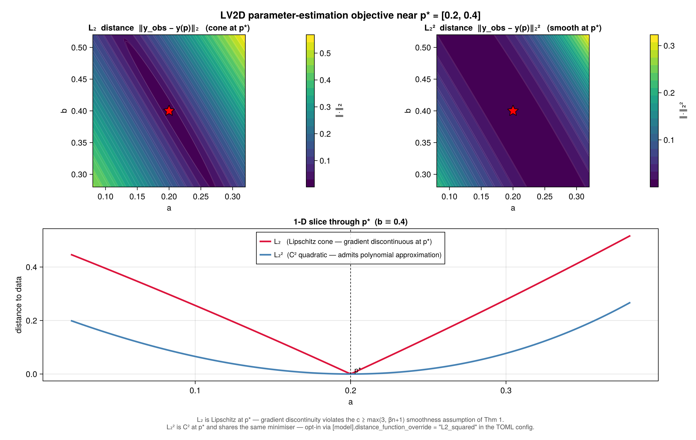

# DynamicObjectives.jl Documentation

**Dynamical system objective functions for global optimization and parameter estimation experiments.**

## The Problem

Parameter estimation in dynamical systems is fundamentally hard. Given observed time series data from an ODE system, how do you find the parameters that best explain the data? Standard optimization algorithms can get stuck in local minima, and the objective function landscape for ODE fitting is often highly multimodal.

## The Approach

DynamicObjectives provides **29 benchmark ODE models** specifically designed for testing global optimization algorithms on parameter estimation tasks. Each model:

1. **Defines an ODE system** — Using ModelingToolkit.jl for symbolic representation
2. **Generates synthetic data** — Time series from true parameters with optional noise
3. **Creates objective functions** — Returns error between simulated and reference trajectories
4. **Handles failures gracefully** — Returns `Inf` on solver failures (optimization-friendly)

The result: a systematic way to benchmark parameter estimation algorithms across problems of varying difficulty.

## Key Features

### 29 ODE Benchmark Models

| Difficulty | Models | Parameters |
|------------|--------|------------|
| Easy | Lotka-Volterra 2D (v1, v2, v3, 2-output, SciML) | 2 params |
| Medium | LV 3D/4D, DAISY, FHN 2-out, Goodwin 3D, RMA, LV2D reparam | 3-4 params |
| Medium-Hard | LV 4D Constrained, Simple 1D, Coupled LV2D | 1-4 params |
| Hard | FHN, Goodwin 4D, Lorenz, Rossler, identifiability tests | 1-4 params |
| Very Hard | Generalized Lotka-Volterra 4D | 20 params |

See [Model Catalog](model_catalog.md) for complete details.

### Robust Error Handling

- **Returns `Inf` on failures** — No exceptions during optimization
- **Timeout mechanism** — Prevents ODE solver from stalling
- **Multiple distance metrics** — L1, L2, log-L2 norms

### Flexible Data Generation

- **Synthetic time series** with configurable sampling
- **Optional noise injection** for robustness testing
- **Full/partial observability** — 1-4 measured outputs

### Display Infrastructure

Pretty, readable output for models, parameters, and results:

```julia
display_model_summary(model)
display_parameters(param_names, values)
display_time_series(data)
```

## Installation

DynamicObjectives is not registered; install it from this repository:

```julia
using Pkg
Pkg.add(url = "https://github.com/gescholt/DynamicObjectives.jl")
```

Or, for development against a local checkout:

```julia
using Pkg
Pkg.develop(path="/path/to/DynamicObjectives")
```

Or add to your `Project.toml`:

```toml
[deps]
DynamicObjectives = "a7860e71-583f-4874-99b9-9df52d7a8e5c"

[sources]
DynamicObjectives = {path = "../DynamicObjectives"}
```

## Quick Start

```julia
using DynamicObjectives

# 1. Define an ODE system
model, params, states, outputs = define_lotka_volterra_2D_model_v3()

# 2. Set up the parameter estimation problem
p_true = [1.0, 1.0]
ic = [1.0, 1.0]
time_interval = [0.0, 10.0]
numpoints = 25

# 3. Create objective function
error_func = make_error_distance(
    model, outputs, ic, p_true, time_interval, numpoints,
    L2_norm, first, nothing;
    return_inf_on_error = true,
    eval_timeout = 10.0
)

# 4. Test at true parameters
@assert error_func(p_true) < 1e-6  # Should be ~0
```

## Distance Metrics: L₂ vs L₂²

The choice of distance function shapes the parameter-estimation landscape near `p_true`. The default `L2_norm` is **Lipschitz at the minimum** (a cone, gradient-discontinuous); switching to `L2_squared` produces a **C² quadratic basin** at the same minimiser.



The 1-D slice (bottom) makes the distinction sharp: `L2_norm` is V-shaped at `p*`, while `L2_squared` is U-shaped. This matters for the polynomial-approximation guarantee in Globtim — Thm 1 requires `c ≥ max(3, βn+1)` continuous derivatives of the objective, which `L2_norm` violates at the minimum but `L2_squared` satisfies.

Opt in per experiment via the TOML config:

```toml
[model]
distance_function_override = "L2_squared"
```

Available metrics: `L2_norm` (default), `L2_squared`, `log_L2_norm`. The figure above was regenerated with `examples/figures/l2_vs_l2squared.jl`.

## Contents

- [API Reference](api.md) — docstrings for every exported model, objective builder, and helper

The narrative documentation for these objectives is maintained in the
[Globtim documentation](https://gescholt.github.io/Globtim.jl/dev/ode_parameter_estimation/),
next to the optimizer that consumes them:

- [Model Catalog](https://gescholt.github.io/Globtim.jl/dev/model_catalog/) — all 29 models with configurations and recommended testing sequences
- [Glued Objectives](https://gescholt.github.io/Globtim.jl/dev/glued_objectives/) — higher-dim test problems with known CP sets via Cartesian-product gluing
